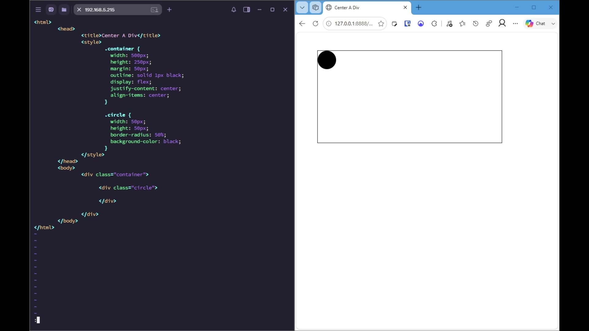

# Centering a Child Element with Flexbox in Vim

The evidence shows the container CSS updated to use Flexbox for horizontal and vertical centering, followed by instructions to save and exit Vim.

## 1. Add Flexbox centering to the container

**Type:** setup  
**Source:** [00:00:05](source.mp4#t=5.040)  
**Confidence:** 99%

Set the container to a flex layout, then center its child on both axes with `justify-content` and `align-items`.



### Commands

```sh
display: flex;
justify-content: center;
align-items: center;
```

### Visible text

```text
.container {
  width: 500px;
  height: 250px;
  margin: 50px;
  outline: solid 1px black;
  display: flex;
  justify-content: center;
  align-items: center;
}
```

### OCR corroboration (72% mean word confidence)

```text
© wm X 192168.5.215 : 40 o x @ Center A div so
<html> € CO 12001888.. Y OE © Gla FD FQ - Gor
<head>
<titlecenter A Div</title>
<style>
«container {
width: 509px; ry
margin: 50px;
outline: solid 1px black;
display: flex;
justify-content: center;
align-items: center;
}
-circle {
border-radius: 50%;
background-color: black;
}
</style>
</head>
<body>
<div class="container">
<div class="circle">
</div>
</div>
</body>
</html>
```

Command/OCR agreement: 100%

### Transcript evidence

> Now to exit VIM, hit Escape, then colon wq! to save.

Span: 00:00:05–00:00:08

## 2. Save and exit Vim

**Type:** command  
**Source:** [00:00:05](source.mp4#t=5.040)  
**Confidence:** 94%

Leave insert mode with Escape, then use the Vim write-and-quit command with force.


### Commands

```sh
Escape
:wq!
```

### Visible text

```text
:
```

### OCR corroboration (72% mean word confidence)

```text
© wm X 192168.5.215 : 40 o x @ Center A div so
<html> € CO 12001888.. Y OE © Gla FD FQ - Gor
<head>
<titlecenter A Div</title>
<style>
«container {
width: 509px; ry
margin: 50px;
outline: solid 1px black;
display: flex;
justify-content: center;
align-items: center;
}
-circle {
border-radius: 50%;
background-color: black;
}
</style>
</head>
<body>
<div class="container">
<div class="circle">
</div>
</div>
</body>
</html>
```

Command/OCR agreement: 40%

### Transcript evidence

> Now to exit VIM, hit Escape, then colon wq! to save.

Span: 00:00:05–00:00:08

## Limitations

- The browser preview in frame 1 still shows the circle at the upper-left of the container, so the centered result is not visually confirmed; the page may not yet have been saved or refreshed.
- Only the initial colon is visible on Vim's command line. The full `:wq!` command is supported by the transcript rather than shown completely in the frame.
